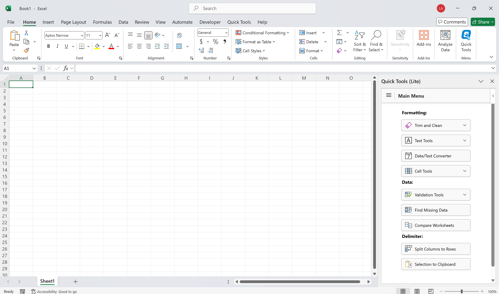

# XLQuickTools Lite (Office 365 / Mac / Web)

**Quick Tools Lite** is a lightweight, cross-platform version of my [Quick Tools](https://github.com/lsementa/XLQuickTools) VSTO Excel Add-In.

## Platform Comparison

| Version             | Platform(s) Supported                           | Technology      |
|---------------------|--------------------------------------------------|-----------------|
| **QuickTools**  | Windows Excel Desktop only                       | .NET (VSTO)     |
| **QuickTools Lite**  | Office 365 (Windows & Mac), Excel Online         | Office.js + Web |

## Features

### Formatting Tools
- **Trim and Clean** – Removes any leading, trailing, or extra spaces and non-printable characters from cells. Also removes two or more consecutive spaces between characters.
- **Text Options** – Includes:
  - Add Leading/Trailing Text
  - Convert to Uppercase
  - Convert to Lowercase
  - Convert to Propercase (Title Case)
  - Remove Letters `[A-Z]`
  - Remove Numbers `[0-9]`
  - Remove Special Characters `[~!@#$%^&*]`
- **Date/Text Converter** – Converts date formats or dates stored as text between different regional styles. Easily switch between Excel and text dates.

---

### Empty Cells
- **Delete Empty Rows** – Removes rows with no data.
- **Delete Empty Columns** – Removes columns with no data.
- **Fill Down** – Fills down values in empty cells based on the cell above.

---

### Data Validation Tools
- **Check for Duplicates** – Identifies duplicate values in a column and inserts a count if duplicates exist.
- **Filter** – Provides easy access to Excel's built-in filter inside the task pane.
- **Column Information** – Displays details on the selected column: unique values, blanks, non-blanks, and total row count.
- **Reset Column** – Resets formatting and data handling; converts numbers stored as text back to proper number format.
- **Find Missing Data** – Finds missing data between two ranges. Generates a report and can highlight missing values.
- **Compare Worksheets** – Compares two worksheets. Generates a difference report and can highlight mismatches.

---

### Delimiter Tools
- **Split Columns to Rows** – Splits delimited column values into rows, handling varying delimiter lengths.
- **Selection to Clipboard** – Copies selected cells to clipboard with a delimiter, with optional leading/trailing text.  
  Example: `1,2,3` → `'a','b','c'`

---

## How to Install/Use QuickTools Lite

1. [Place Holder]
2. [Place Holder]
